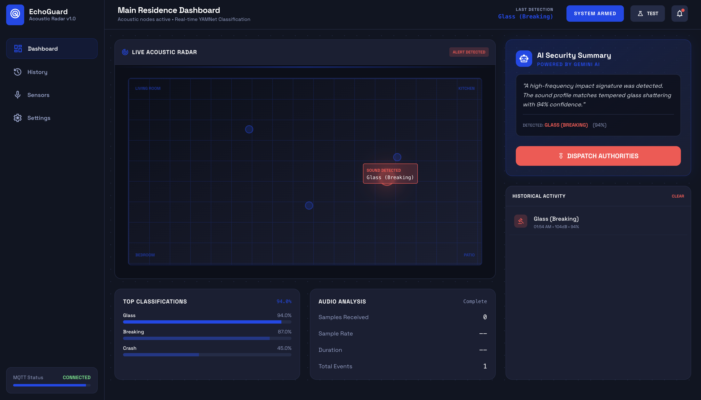

# EchoGuard

A distributed acoustic threat detection system for home security. EchoGuard uses a network of microcontrollers with ML-powered sound classification to detect dangers like glass breaking, smoke alarms, and intrusions—then alerts homeowners with AI-generated voice notifications.


.png)

## Overview

EchoGuard consists of three main components:

- **ESP32/STM32 Nodes** (`esp32/`, `stm32/`) - Edge devices that capture audio and transmit to the server via MQTT
- **Server** (`server/`) - Flask backend with YAMNet ML classification, real-time dashboard, and voice alert generation
- **Web Dashboard** - Live visualization of sensor grid, threat detection, and triangulated source locations

## Key Features

- **YAMNet Classification**: 521-class audio recognition for threat detection (glass break, alarms, screams)
- **Gemini AI Analysis**: Natural language threat assessment and response recommendations  
- **ElevenLabs Voice Alerts**: AI-generated spoken notifications when threats are detected
- **Real-time Dashboard**: WebSocket-powered map showing sensor status and detection events
- **MQTT Communication**: Lightweight pub/sub messaging between edge nodes and server

## Tech Stack

- **Edge**: ESP32 (PlatformIO), STM32G4 (C/HAL)
- **Server**: Python, Flask, Flask-SocketIO
- **ML**: TensorFlow Hub (YAMNet), Google Gemini API
- **Voice**: ElevenLabs TTS API
- **Messaging**: MQTT (Mosquitto)
- **Frontend**: HTML/CSS/JS, Leaflet.js

## Quick Start

```bash
cd server
pip install -r requirements.txt
# Set environment variables
export GEMINI_API_KEY="your-key"
export ELEVENLABS_API_KEY="your-key"
# Run
python app.py
```

Open http://localhost:8080

## Hardware Setup

See `esp32/` and `stm32/` directories for firmware and wiring diagrams.

