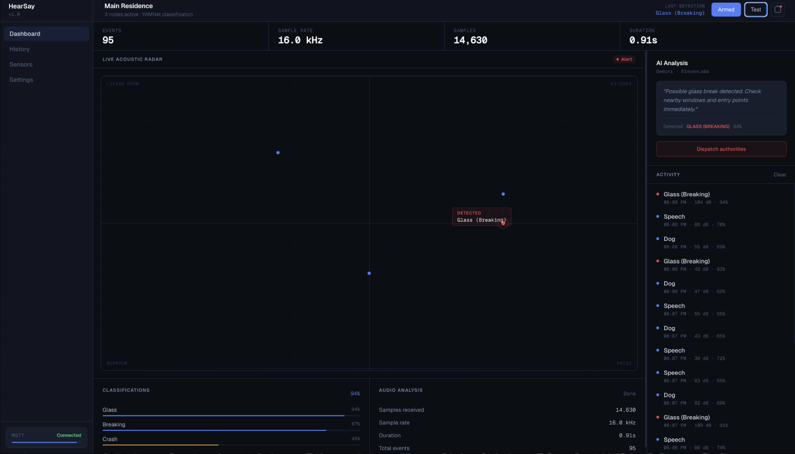
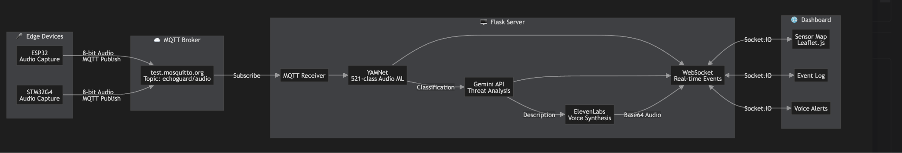
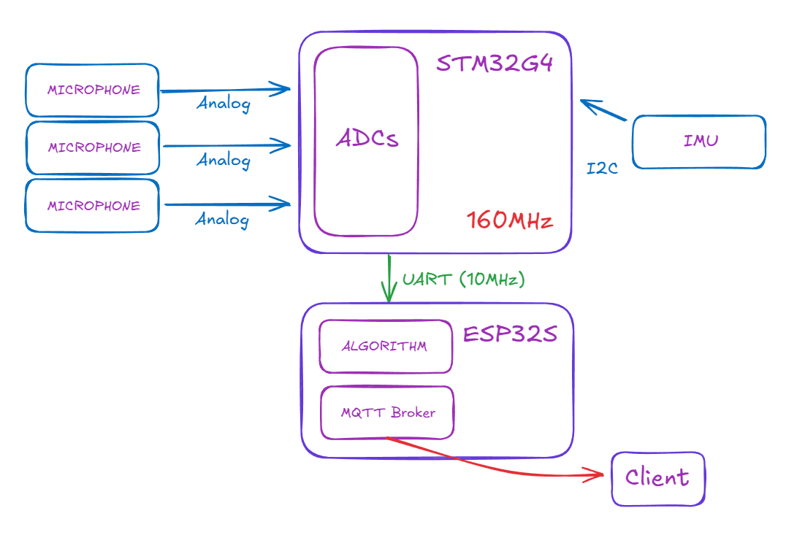

# HearSay

HearSay is a camera-free acoustic security system that captures audio from distributed edge nodes, classifies safety-critical events in real time, and delivers actionable alerts through a live web dashboard.

For software engineering roles, the project demonstrates realtime backend systems, event-driven architecture, frontend alerting, and ML integration. For hardware and embedded roles, it demonstrates ADC/DMA sampling, microcontroller communication, signal-chain debugging, and prototype integration.

<p align="center">
  
</p>

## What This Project Does

- Captures audio from distributed `ESP32` and `STM32G4` edge nodes.
- Streams audio frames over `MQTT` to a Python backend.
- Preprocesses raw 8-bit ADC samples into model-ready waveforms.
- Classifies events with `YAMNet` and maps predictions to threat levels.
- Pushes live detections, confidence scores, and event history to a realtime dashboard.
- Optionally generates contextual summaries and voice alerts with `Gemini` and `ElevenLabs`.

## Recruiter Snapshot

- `Problem`: traditional home security systems are camera-heavy, reactive, and often poor at describing what actually happened.
- `System`: embedded audio capture + realtime messaging + server-side inference + browser-based alerting.
- `Engineering focus`: distributed systems, embedded sampling, signal processing, ML integration, and operator-facing UI.
- `Scope`: built as an end-to-end prototype rather than an isolated firmware demo or model notebook.

## Why It Stands Out

- `Software engineering`: built a realtime ingestion and alerting pipeline using `MQTT`, `Flask`, and `Socket.IO`.
- `Embedded systems`: handled high-rate microphone sampling, ADC/DMA buffering, and microcontroller-to-microcontroller transport.
- `ML systems`: integrated audio preprocessing, inference, confidence gating, and false-positive reduction into a usable product flow.
- `Hardware debugging`: redesigned the analog microphone front-end to fix grounding, clipping, and transient issues before inference.

## Selected Engineering Work

### Software

- Built a realtime event pipeline using `MQTT`, `Flask`, and `Socket.IO` to move audio-derived events from edge devices to the browser with low latency.
- Implemented preprocessing for raw unsigned 8-bit ADC samples, including normalization and resampling into model-compatible waveforms.
- Integrated `YAMNet` inference with backend threat mapping, confidence gating, and alert logic to reduce false positives from ambient noise.
- Developed a live dashboard that renders detections, prediction confidence, timestamps, and event history in realtime.
- Added mock-input mode so the full stack can be tested and demoed without connected hardware.

### Embedded / Hardware

- Sampled microphone input on `STM32G4` using ADC + DMA and forwarded captured audio to an `ESP32` over UART for wireless transport.
- Debugged sample-rate consistency and signal quality issues that directly affected downstream ML performance.
- Reworked the analog microphone circuit around the existing `LM358` amplifier to fix clipping and unstable transients caused by poor biasing.
- Integrated the sensing hardware and compute boards into a compact enclosure suitable for room-level acoustic monitoring.

## System Architecture

<p align="center">
  
</p>

The system is split into three layers:

1. `Edge capture`
   STM32 handles microphone sampling while ESP32 handles transport and wireless connectivity.
2. `Backend processing`
   The server receives audio, normalizes and resamples it, runs classification, applies threat logic, and emits structured events.
3. `Realtime client`
   The dashboard renders detections, confidence levels, event logs, and optional voice playback in the browser.

<p align="center">
  
</p>

## Interesting Technical Problems

- `Realtime audio transport`: moving high-rate sampled data across microcontrollers and into a server pipeline without breaking the live alert loop.
- `Model-ready preprocessing`: converting noisy raw 8-bit embedded audio into normalized waveforms that a pretrained audio model could classify reliably.
- `False-positive control`: tuning confidence thresholds and threat mapping so the system surfaced useful alerts instead of ambient-noise spam.
- `Analog signal integrity`: repairing the microphone front-end after ground-referenced biasing introduced clipping and waveform distortion.

## Hardware Prototype

<p align="center">
  
</p>

This prototype packages the sensing hardware, microcontroller board, and microphone array into a compact enclosure intended for room-level acoustic monitoring.

## Tech Stack

- `Embedded`: C, STM32 HAL, PlatformIO, ESP32
- `Backend`: Python, Flask, Flask-SocketIO
- `Messaging`: MQTT / Mosquitto
- `ML`: TensorFlow Hub, YAMNet
- `AI services`: Gemini API, ElevenLabs API
- `Frontend`: HTML, CSS, JavaScript

## Running Locally

### Demo Mode (no hardware required)

```bash
cd server
python3 -m pip install -r requirements.txt
MOCK_INPUT_MODE=1 DISABLE_YAMNET=1 DISABLE_AUDIO_PLAYBACK=1 python3 app.py
```

Open `http://localhost:8080`.

### Full Mode

```bash
cd server
python3 -m pip install -r requirements.txt
export GEMINI_API_KEY="your-key"
export ELEVENLABS_API_KEY="your-key"
python3 app.py
```

## Repository Layout

- [`server/`](server): Flask backend, realtime dashboard, ML integration
- [`esp32/`](esp32): ESP32 transport and edge logic
- [`stm32/`](stm32): STM32 firmware for audio capture and sampling
- [`audio/`](audio): sample audio assets used during development

## Future Work

- Add robust multi-node localization with time-difference-of-arrival (`TDOA`)
- Push more inference onto the edge for lower latency and offline operation
- Add mobile notifications and a more production-ready alert workflow
